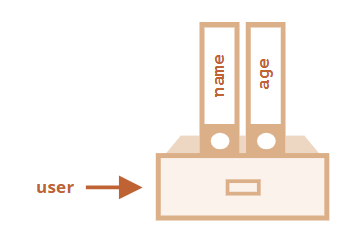

Объект в JavaScript - это тип данных, который может содержать коллекции различных свойств и других более сложных структур. Данные чаще всего объединены общим смыслом, что позволяет оперировать объектом, как единым целым.

Объекты же используются для хранения коллекций различных значений и более сложных сущностей. В JavaScript объекты используются очень часто, это одна из основ языка. Поэтому мы должны понять их, прежде чем углубляться куда-либо ещё.

Объект может быть создан с помощью фигурных скобок {…} с необязательным списком свойств. Свойство – это пара «ключ: значение», где ключ – это строка (также называемая «именем свойства»), а значение может быть чем угодно.

Мы можем представить объект в виде ящика с подписанными папками. Каждый элемент данных хранится в своей папке, на которой написан ключ. По ключу папку легко найти, удалить или добавить в неё что-либо.

Пустой объект («пустой ящик») можно создать, используя один из двух вариантов синтаксиса:

Обычно используют вариант с фигурными скобками {...}. Такое объявление называют литералом объекта или литеральной нотацией.

### Литералы и свойства
При использовании литерального синтаксиса {...} мы сразу можем поместить в объект несколько свойств в виде пар «ключ: значение»:

У каждого свойства есть ключ (также называемый «имя» или «идентификатор»). После имени свойства следует двоеточие ":", и затем указывается значение свойства. Если в объекте несколько свойств, то они перечисляются через запятую.

В объекте user сейчас находятся два свойства:

1.Первое свойство с именем `"name"` и значением `John`.
2.Второе свойство с именем `"age"` и значением 30.
Можно сказать, что наш объект user – это ящик с двумя 
>
>
>

папками, подписанными «name» и «age».

Мы можем в любой момент добавить в него новые папки, удалить папки или прочитать содержимое любой папки.

Для обращения к свойствам используется запись «через точку»:

Значение может быть любого типа. Давайте добавим свойство с логическим значением:

Для удаления свойства мы можем использовать оператор delete:

Имя свойства может состоять из нескольких слов, но тогда оно должно быть заключено в кавычки:

